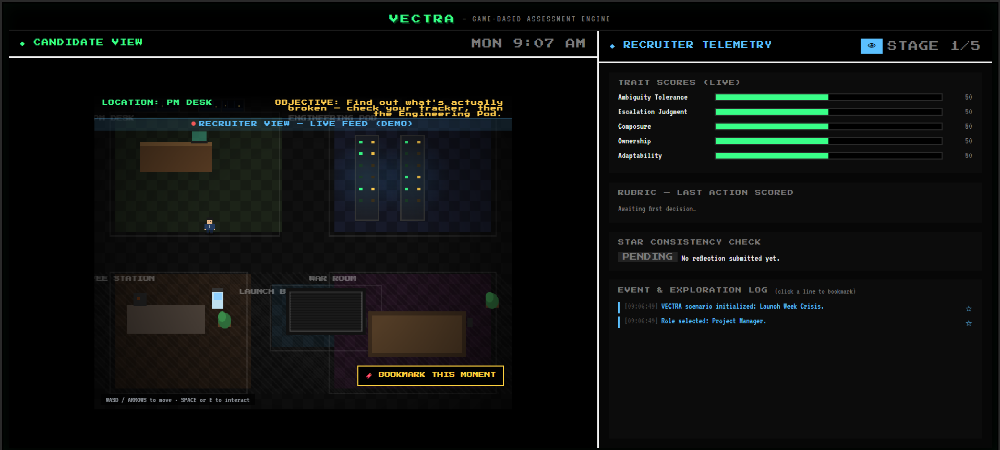
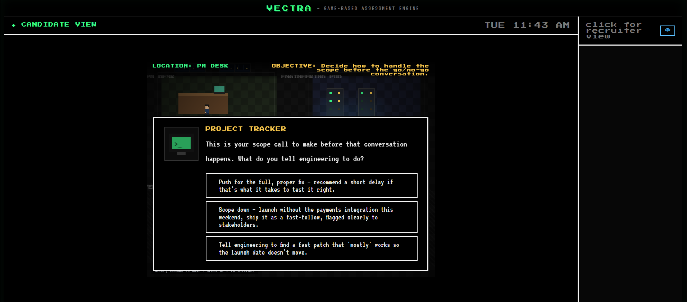
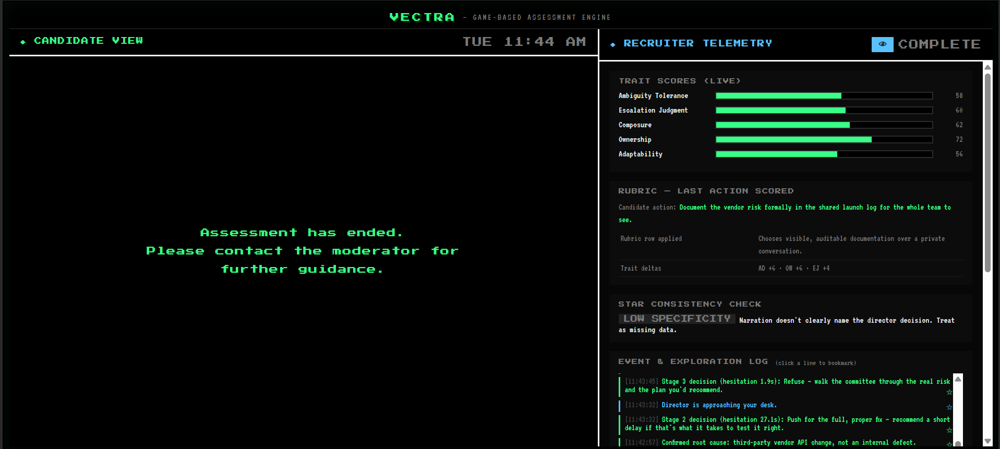
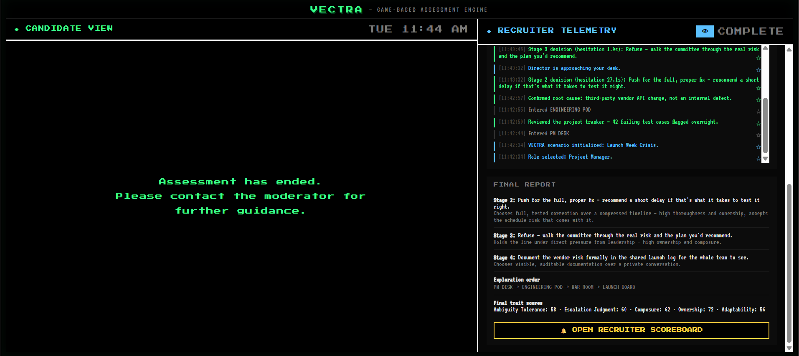

# VECTRA

A game-based recruitment assessment prototype. Instead of a set of unrelated mini-games, the candidate plays through one continuous, job-realistic scenario, and every score can be traced back to a specific decision.

 

## The problem

Most game-based assessments take an abstract psychometric test and wrap it in a game skin. That leaves three gaps:

- **Low face validity.** Candidates pop balloons or sort cards with no visible link to the job.
- **Black-box scoring.** Trait scores come out of a model nobody can fully explain, which is increasingly a legal and trust problem for employers.
- **Fragmentation.** Several disconnected 90-second games can't capture how someone handles a sequence of decisions under shifting pressure.

VECTRA is my attempt at a different approach: one branching scenario, a rubric that is written before any candidate plays, and a scoring trail a recruiter can actually follow.

## What it does

The candidate plays a Project Manager during a launch-week crisis (a vendor API change breaks the payments integration three days before launch). They walk around a pixel-art office, investigate the problem, and make decisions under pressure from a director, marketing, and engineering.

- **Branching decisions.** Earlier choices change who shows up later and what they say.
- **Explainable scoring.** Five traits (Ambiguity Tolerance, Escalation Judgment, Composure, Ownership, Adaptability) are scored per decision against a fixed rubric.
- **Written reflection.** At the end, candidates describe what they did in their own words, and the system checks that account against their logged behavior.
- **Recruiter view.** A toggle reveals a live telemetry panel with trait scores, an event log, hesitation times, and bookmarking, and a scoreboard once the candidate finishes.

 

## Run it

Download `index.html` and open it in any browser. No build step, no dependencies.

Controls: WASD or arrow keys to move, E or Space to interact, click or Space to advance dialogue.

## What's real and what's simplified

This is a prototype, so it helps to be clear about the limits:

- One scenario and one role. The structure is meant to be role-agnostic, but only Project Manager is built.
- The recruiter view is a toggle in the same browser tab, not a separate authenticated session. A real version would need a backend.
- Trait weights come from my rubric design, not from validated norms or inter-rater reliability data.
- The reflection consistency check is keyword-based, which is a rough stand-in for proper text analysis.

## Design decisions

Three things I changed after testing:

- **Removed a timed decision.** A countdown made the data noisier: a careful thinker and a panicked guesser looked the same once the clock ran out.
- **Split the reflection check into two signals.** A mismatch between what someone did and what they wrote could mean misrepresentation, or it could mean modesty. Those shouldn't be flagged the same way.
- **Rescaled the scoreboard grade.** With only three scored decisions, the best possible score a candidate could ever reach was 62 out of 100, and the worst was 46 — so the top and bottom grades were mathematically impossible before anyone played. I fixed this by grading each candidate against the scenario's actual best and worst possible outcome, rather than an arbitrary 0–100 scale that the scenario could never fill.

The full reasoning behind all three, including a worked example of a rubric row, is in [`docs/methodology.md`](docs/methodology.md).

## About

I designed the scenario, trait rubric, and scoring logic as an HR / people analytics project. The code was built with AI assistance (Claude).

## License

MIT
